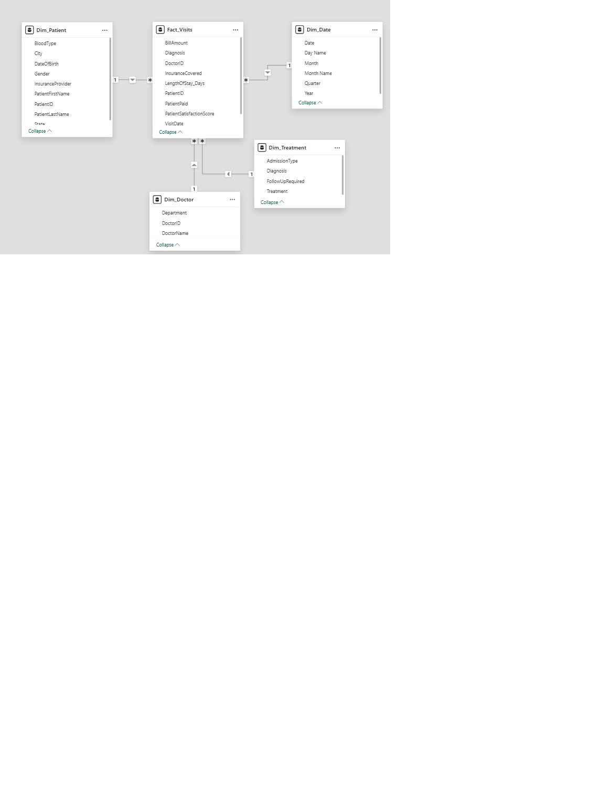

# HealthcareDB Star Schema

A full SQL Server data warehouse project built from 17 normalized synthetic healthcare CSV tables, modeled into a star schema and extended to a snowflake schema.

## Project Overview
This project demonstrates end-to-end data modeling — from raw CSV ingestion to a published Power BI dashboard.

## Schema Design
- **Fact Table:** FactVisit — tracks patient visits with deduplication logic using ROW_NUMBER() OVER (PARTITION BY VisitID)
- **Dimensions:** DimPatient, DimDoctor, DimWard, DimDate
- **Snowflake Extension:** DimDepartment branching off DimDoctor
 ## Schema Diagram

 

## Key Techniques
- DimDate built as a 1,096-row calendar (2023–2025) using ROW_NUMBER() date generator
- Billing deduplication using ROW_NUMBER() OVER (PARTITION BY VisitID ORDER BY BillingID)
- Star schema connected to Power BI with KPI cards, slicers, and published dashboard

## Tools
- SQL Server (SSMS)
- Power BI Desktop & Service
- T-SQL

## Author
Jonah Elijah | github.com/jonahelijah
